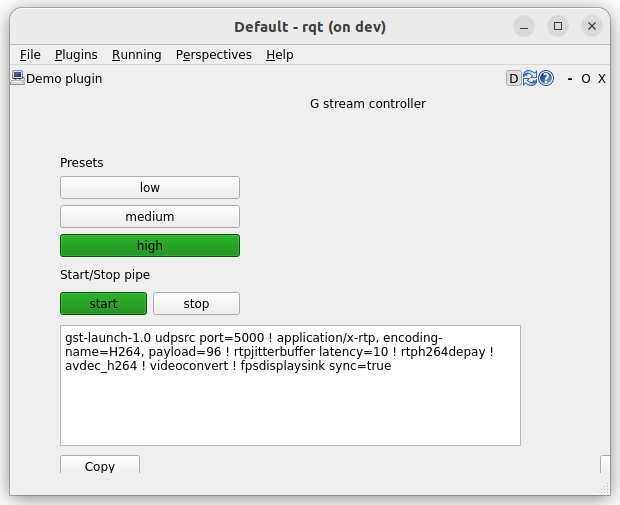

# G_STREAM

Ros package the stream Images msg as h264/5 udp stream using gstreamer
The package base on gstreamer python binding 

The package use parameters_utils package to persist encode settings 

The package declare 3 presets

- low
- medium
- high

Etch preset defined :
- bitrate
- fps
- iframe_interval
- vbv

## Parameters

| Name  | Description  | Values |
|---|---|--|
| encoder_type  | encoder  | h264, h265 |
| hardware | witch type of encode to use cpu base or acceleration | pc, nvidia |
| height | image height | override from camera_info if exists |
| width | image width | override from camera_info if exists |
| ip_address | host ip to stream to |   |
| port | host port |  |
| mtu  | control packet mtu | 1400 |
| preset | default preset to start | high, medium, low |


> [TIP]
> receiver_pipe: gstreamer pipe to check the stream

> [TIP]
> param_yaml_full_path: persist file to save preset settings


persist file point by `param_yaml_full_path` parameter
```
/stream:
    low:
        fps: 200
        bitrate: 1
        iframe_interval: 1
        vbv: 1
    medium:
        fps: 200
        bitrate: 10
        iframe_interval: 1
        vbv: 1
    high:
        fps: 500
        bitrate: 10
        iframe_interval: 1
        vbv: 1
```

### Demo
- Run gscam with `videotestsrc` as video source
- Run stream_node
- Run gstreamer pipe as receiver


```bash
export GSCAM_CONFIG="videotestsrc pattern=ball ! video/x-raw,width=640,height=480,framerate=10/1 ! videoconvert"
ros2 run gscam gscam_node
```

```bash
ros2 run g_stream stream_node.py --ros-args --params-file stream_pc_264.yaml
```

```bash
gst-launch-1.0 udpsrc port=5000 ! application/x-rtp, encoding-name=H264, payload=96 ! rtpjitterbuffer latency=10 ! rtph264depay ! avdec_h264 ! videoconvert ! fpsdisplaysink sync=true
```

<details>

<summary>stream_pc_264.yaml</summary>

```yaml
/**/stream:
  ros__parameters:
    diagnostic_updater.period: 1.0
    diagnostic_updater.use_fqn: false
    encoder_type: h264
    hardware: pc
    height: 480
    high.bitrate: 1000
    high.fps: 9
    high.iframe_interval: 9
    high.vbv: 1000
    ip_address: 127.0.0.1
    low.bitrate: 200
    low.fps: 5
    low.iframe_interval: 5
    low.vbv: 200
    medium.bitrate: 350
    medium.fps: 9
    medium.iframe_interval: 9
    medium.vbv: 350
    mtu: 1400
    param_yaml_full_path: /workspace/src/g_stream/config/subset.yaml
    port: 5000
    preset: high
    receiver_pipe: "\n                gst-launch-1.0 udpsrc port=5000 ! application/x-rtp,\
      \ encoding-name=H264, payload=96 ! rtpjitterbuffer latency=10 ! rtph264depay\
      \ ! avdec_h264 ! videoconvert ! fpsdisplaysink sync=true\n                "
    test_enable: false
    use_sim_time: false
    width: 640
    on_image_time_stamp: true

```

</details>


---

### Control





### Services

| name  | Description  |
|---|---|
| set_preset  | set preset  parameter and restart the stream |
| start_stop  | start / stop stream  |


```bash
ros2 service call /stream/start_stop std_srvs/srv/SetBool "{data: true}"
ros2 service call /stream/start_stop std_srvs/srv/SetBool "{data: false}"
```

```bash
ros2 service call /stream/set_preset g_stream_interface/srv/Preset "{preset: high}"
ros2 service call /stream/set_preset g_stream_interface/srv/Preset "{preset: low}"
```

